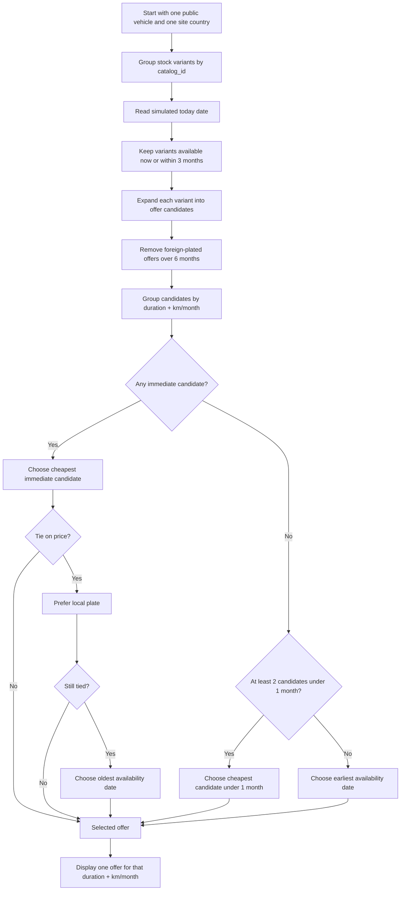

# Vehicle Display Algorithm Demo

Flask prototype for testing a vehicle display algorithm based on the website country, vehicle registration country, available offers, pricing, mileage packages, and availability dates.

## Goal

The project simulates three country-specific websites: France, Belgium, and Luxembourg.

The same public vehicle model can exist as multiple stock variants:

- different registration country: `FR`, `BE`, `LU`
- different condition: `neuf` or `occasion`
- different availability date
- different offer grid: duration, km/month, price

The public catalog groups variants of the same model through `catalog_id`, then displays only the eligible offers.

## Business Rules

- Offers belong to a vehicle stock variant, not to a website.
- A vehicle registered in a country different from the visited website can only display offers up to 6 months.
- The catalog only considers stock variants available within the next 3 months from the simulated date.
- An empty availability date means the stock is available immediately.
- The algorithm runs independently for each displayed availability slot, meaning each `duration + km/month` combination is selected on its own.
- The same logic applies on the vehicle detail page.

## Selection Algorithm

The algorithm works in two layers:

1. Build the list of eligible candidate offers.
2. Pick the best candidate for each `duration + km/month` combination.

### Eligibility Layer

A stock variant can only participate in the selection if all these conditions are true:

- Its availability date is empty, already reached, or within the next 3 months from the simulated `today` date.
- Its offer exists for the requested `duration + km/month` combination.
- If the vehicle registration country is different from the visited website country, the offer duration is at most 6 months.

This means a new `duration + km/month` combination can appear dynamically as soon as a compatible stock variant enters the 3-month availability window. Example: if a BE-plated Macan has a `12 months / 1000 km` offer and becomes available within the next 3 months, that combination starts appearing on the BE website. Before that, it is hidden.

### Selection Layer

Once eligible candidates are grouped by `duration + km/month`, the selected offer is chosen with the following priority order.

If at least one candidate is available immediately:

- Immediate availability is absolute priority.
- Among immediate candidates, choose the cheapest price.
- If prices are equal, prefer a vehicle plated in the visited website country.
- If there is still a tie, choose the vehicle that has been available for the longest time.

If no candidate is available immediately:

- Look at candidates available within 1 month from the simulated date.
- If two or more candidates are available within 1 month, choose the cheapest among those candidates.
- If only one candidate is available within 1 month, choose that first available candidate, even if a later one is cheaper.
- If no candidate is available within 1 month, choose the candidate with the earliest availability date.
- Remaining ties use price, then local registration country, as deterministic tie-breakers.

### Algorithm Diagram



## Demo Data

The dataset in `data/vehicles.json` intentionally contains many variants to exercise the main decision paths:

- `porsche-911-carrera-s`: multiple BE and LU variants with immediate and future availability.
- `porsche-macan-4`: a foreign immediate 6-month offer and a BE future long-duration offer, showing how a new 12/18-month availability appears when the local stock enters the 3-month window.
- `audi-rs6-avant`: immediate local stock plus a cheaper foreign 6-month stock; long foreign offers remain hidden by the 6-month cap.
- `bmw-430i-cabriolet`: two future candidates under 1 month, where price wins.
- `tesla-model-3`: one candidate under 1 month versus a later cheaper candidate, where earliest availability wins.
- `mercedes-gle-coupe`: no candidate under 1 month, where earliest availability wins even if a later stock is cheaper.
- `alfa-romeo-giulia`: same immediate price where the local plate wins.
- `range-rover-sport`: same immediate price with no local plate, where the oldest availability date wins.
- `volvo-ex30`: future stock outside the 3-month window for early simulated dates.

## Run Locally

```bash
python3 -m pip install -r requirements.txt
python3 -m flask --app app run --port 5002
```

Then open:

```text
http://127.0.0.1:5002
```

Admin interface:

```text
http://127.0.0.1:5002/admin
```

## Test With ngrok

In a first terminal:

```bash
python3 -m flask --app app run --port 5002
```

In a second terminal:

```bash
ngrok http 5002
```

Share the public ngrok URL with testers.

## Admin Workflow

In `/admin`, each row represents a stock variant.

Important fields:

- `Reference catalogue`: groups multiple stock variants under the same public vehicle.
- `Pays d'immatriculation`: defines whether the vehicle is local or foreign for a website.
- `Type`: `neuf` or `occasion`.
- `Date de disponibilite`: used by the 3-month availability filter.
- `Offres disponibles`: complete `duration / km per month / price` grid.

The `+ Variante` button quickly creates the same vehicle with another registration country, another condition, or another pricing grid.

## Test the Algorithm

```bash
behave
```

The BDD scenarios cover:

- foreign-registered vehicles limited to 6 months
- immediate availability priority
- price priority among immediate vehicles
- local-plate tie-breaks
- oldest-availability tie-breaks
- under-1-month future prioritization
- earliest future availability when price is not the deciding factor
- aggregation of multiple stock variants under one public vehicle
- multiple mileage options
- dynamic filtering by availability date

## Useful API

Catalog:

```text
GET /api/catalog?site=BE&today=2026-04-27
```

Vehicle detail:

```text
GET /api/vehicle/<catalog_id>?site=LU&today=2026-04-27
```

Parameters:

- `site`: `BE`, `FR`, or `LU`
- `today`: simulated date in `YYYY-MM-DD` format

## Quick Render Deployment

The project includes a `Procfile`:

```text
web: gunicorn app:app
```

On Render:

- Build Command: `pip install -r requirements.txt`
- Start Command: `gunicorn app:app`
- Instance Type: `Free`

Note: on free hosting with an ephemeral filesystem, changes made to `data/vehicles.json` through the admin can be lost after redeploys or restarts. For durable multi-user persistence, use a database.
