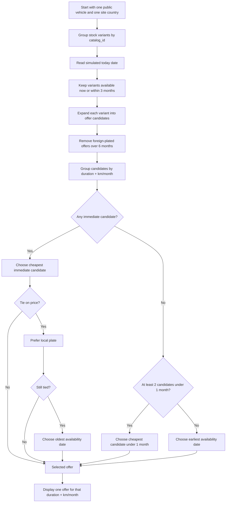

# Vehicle Display Algorithm Demo

Flask prototype for testing a vehicle display algorithm based on the website country, vehicle registration country, available offers, pricing, mileage packages, and availability dates.

## Goal

The project simulates three country-specific websites: France, Belgium, and Luxembourg.

The same public vehicle model can exist as multiple stock variants:

- different registration country: `FR`, `BE`, `LU`
- different condition: `neuf` or `occasion`
- different availability date
- different offer grid: duration, km/month, price

The public catalog groups variants of the same model through `catalog_id`, then displays only the eligible offers.

## Business Rules

- Offers belong to a vehicle stock variant, not to a website.
- A vehicle registered in a country different from the visited website can only display offers up to 6 months.
- The catalog only considers stock variants available within the next 3 months from the simulated date.
- An empty availability date means the stock is available immediately.
- The algorithm runs independently for each displayed availability slot, meaning each `duration + km/month` combination is selected on its own.
- The same logic applies on the vehicle detail page.

## Selection Algorithm

The algorithm works in two layers:

1. Build the list of eligible candidate offers.
2. Pick the best candidate for each `duration + km/month` combination.

### Eligibility Layer

A stock variant can only participate in the selection if all these conditions are true:

- Its availability date is empty, already reached, or within the next 3 months from the simulated `today` date.
- Its offer exists for the requested `duration + km/month` combination.
- If the vehicle registration country is different from the visited website country, the offer duration is at most 6 months.

This means a new `duration + km/month` combination can appear dynamically as soon as a compatible stock variant enters the 3-month availability window. Example: if a BE-plated Macan has a `12 months / 1000 km` offer and becomes available within the next 3 months, that combination starts appearing on the BE website. Before that, it is hidden.

### Selection Layer

Once eligible candidates are grouped by `duration + km/month`, the selected offer is chosen with the following priority order.

If at least one candidate is available immediately:

- Immediate availability is absolute priority.
- Among immediate candidates, choose the cheapest price.
- If prices are equal, prefer a vehicle plated in the visited website country.
- If there is still a tie, choose the vehicle that has been available for the longest time.

If no candidate is available immediately:

- Look at candidates available within 1 month from the simulated date.
- If two or more candidates are available within 1 month, choose the cheapest among those candidates.
- If only one candidate is available within 1 month, choose that first available candidate, even if a later one is cheaper.
- If no candidate is available within 1 month, choose the candidate with the earliest availability date.
- Remaining ties use price, then local registration country, as deterministic tie-breakers.

### Algorithm Diagram



## Demo Data

The dataset in `data/vehicles.json` has two purposes:

- Realistic demo models such as Porsche, McLaren, Lamborghini, Ferrari, Bentley, Maserati, Mercedes-AMG, Rolls-Royce, Range Rover, BMW M, and Lotus make the catalog feel closer to a premium landing page.
- Explicit `Case XX` models make every business rule easy to verify without guessing which vehicle is supposed to demonstrate which behavior.

Unless specified otherwise, the case matrix below is designed to be tested on the BE website with `today=2026-04-27` and the slot `6 months / 1000 km`.

| Requested case | Demo catalog id | Demo vehicle name | What should happen |
| --- | --- | --- | --- |
| 1 vehicle, 1 country, available now | `case-01-one-local-now` | Case 01 Lamborghini Huracan Tecnica | The only BE stock is displayed at `301 EUR`. |
| 2 vehicles, 1 country, both available now | `case-02-two-local-now` | Case 02 Porsche 911 Turbo S | Both stocks are BE and immediate, so the cheapest stock wins: `390 EUR`. |
| 2 vehicles, 2 countries, both available now | `case-03-two-countries-now` | Case 03 McLaren Artura | Both are immediate, so price wins even if the cheapest stock is foreign: FR at `480 EUR`. |
| 1 vehicle, 1 country, available exactly in 3 months | `case-04-one-local-three-months` | Case 04 Ferrari Roma Spider | The stock is included because `2026-07-27` is exactly 3 months after `2026-04-27`. |
| 1 vehicle, 1 country, available in less than 1 month | `case-05-one-local-under-one-month` | Case 05 Aston Martin Vantage | The only future stock is displayed because it is inside the 3-month window. |
| 2 vehicles, 2 countries, one now and one under 1 month cheaper | `case-06-now-vs-under-one-cheaper` | Case 06 Lamborghini Urus Performante | Immediate availability is absolute priority, so BE now at `700 EUR` beats FR future at `450 EUR`. |
| 2 vehicles, 2 countries, one now and one under 1 month more expensive | `case-07-now-vs-under-one-expensive` | Case 07 Porsche Taycan Turbo GT | BE now at `500 EUR` wins; the future FR stock is both later and more expensive. |
| 2 vehicles, 2 countries, one now and one over 1 month cheaper | `case-08-now-vs-over-one-cheaper` | Case 08 McLaren 750S | BE now at `900 EUR` wins even though FR later is cheaper. |
| 2 vehicles, 2 countries, both under 1 month with one cheaper | `case-09-two-under-one-cheaper` | Case 09 Ferrari 296 GTB | No stock is immediate and both are under 1 month, so price wins: FR at `520 EUR`. |
| 2 vehicles, 2 countries, one now and one over 1 month cheaper | `case-10-now-vs-over-one-cheaper-bis` | Case 10 Bentley Continental GT Speed | Same priority as Case 08, kept as a second explicit regression case: BE now wins. |
| 2 vehicles, 2 countries, one now and one under 1 month cheaper | `case-11-now-vs-under-one-cheaper-bis` | Case 11 Maserati MC20 Cielo | Same priority as Case 06, kept as a second explicit regression case: BE now wins. |

Additional edge cases that are easy to forget:

| Edge case | Demo catalog id | Demo vehicle name | What should happen |
| --- | --- | --- | --- |
| Immediate candidates with same price and one local plate | `case-12-same-price-local-wins` | Case 12 Mercedes-AMG GT 63 S E Performance | BE wins over FR because the price is tied and BE matches the visited site. |
| Immediate candidates with same price and no local plate | `case-13-same-price-oldest-wins` | Case 13 Rolls-Royce Spectre | FR wins over LU because neither plate is BE and FR has been available longer. |
| No immediate stock, only one candidate under 1 month, later stock is cheaper | `case-14-one-under-one-vs-later-cheaper` | Case 14 Audi RS e-tron GT | The first available stock wins even though the later stock is cheaper. |
| No immediate stock and no candidate under 1 month | `case-15-no-under-one-earliest-wins` | Case 15 BMW M8 Competition | The earliest availability date wins before price is considered. |
| Foreign 12-month offer exists but must be hidden, local long-duration offer appears | `case-16-foreign-cap-local-long` | Case 16 Porsche Cayenne Turbo E-Hybrid Coupe | FR can only provide 6 months on BE; BE provides the visible 12-month slot. |
| Stock outside the 3-month window | `case-17-outside-three-months` | Case 17 Lotus Emeya R | Hidden on `2026-04-27`, then enters the catalog once the simulated date reaches `2026-05-01`. |

The older realistic examples remain useful for visual testing:

- `porsche-macan-4`: shows a foreign immediate 6-month offer and BE future long-duration offers.
- `audi-rs6-avant`: shows immediate local stock plus a cheaper foreign 6-month stock.
- `bmw-m4-competition-cabriolet`: shows two future candidates under 1 month where price wins.
- `tesla-model-s-plaid`: shows one candidate under 1 month versus a later cheaper candidate.
- `mercedes-amg-g63`: shows earliest future availability winning when no stock is under 1 month.
- `maserati-granturismo-trofeo`: shows the local-plate tie-break.
- `range-rover-sport`: shows the oldest-availability tie-break.
- `lotus-eletre-r`: shows stock outside the 3-month window.

## Run Locally

```bash
python3 -m pip install -r requirements.txt
python3 -m flask --app app run --port 5002
```

Then open:

```text
http://127.0.0.1:5002
```

Admin interface:

```text
http://127.0.0.1:5002/admin
```

## Test With ngrok

In a first terminal:

```bash
python3 -m flask --app app run --port 5002
```

In a second terminal:

```bash
ngrok http 5002
```

Share the public ngrok URL with testers.

## Admin Workflow

In `/admin`, each row represents a stock variant.

Important fields:

- `Reference catalogue`: groups multiple stock variants under the same public vehicle.
- `Pays d'immatriculation`: defines whether the vehicle is local or foreign for a website.
- `Type`: `neuf` or `occasion`.
- `Date de disponibilite`: used by the 3-month availability filter.
- `Offres disponibles`: complete `duration / km per month / price` grid.

The `+ Variante` button quickly creates the same vehicle with another registration country, another condition, or another pricing grid.

## Test the Algorithm

```bash
behave
```

The BDD scenarios cover:

- foreign-registered vehicles limited to 6 months
- the full requested 11-case priority matrix
- immediate availability priority
- price priority among immediate vehicles
- local-plate tie-breaks
- oldest-availability tie-breaks
- under-1-month future prioritization
- earliest future availability when price is not the deciding factor
- aggregation of multiple stock variants under one public vehicle
- multiple mileage options
- dynamic filtering by availability date

## Useful API

Catalog:

```text
GET /api/catalog?site=BE&today=2026-04-27
```

Vehicle detail:

```text
GET /api/vehicle/<catalog_id>?site=LU&today=2026-04-27
```

Parameters:

- `site`: `BE`, `FR`, or `LU`
- `today`: simulated date in `YYYY-MM-DD` format

## Quick Render Deployment

The project includes a `Procfile`:

```text
web: gunicorn app:app
```

On Render:

- Build Command: `pip install -r requirements.txt`
- Start Command: `gunicorn app:app`
- Instance Type: `Free`

Note: on free hosting with an ephemeral filesystem, changes made to `data/vehicles.json` through the admin can be lost after redeploys or restarts. For durable multi-user persistence, use a database.
